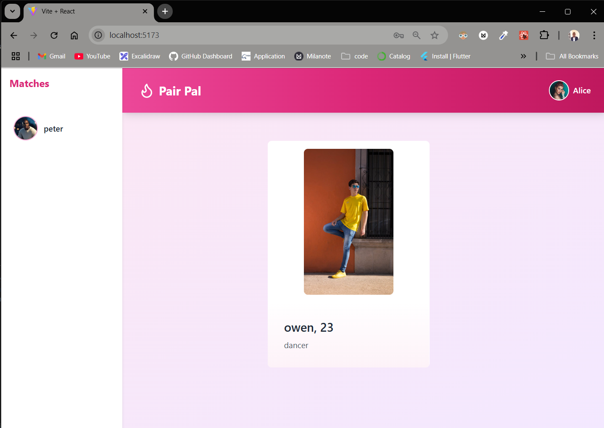

# Tinder Clone

## Table of Contents

- [Frontend](#frontend)
- [Backend](#backend)
- [Installation](#installation)
- [Usage](#usage)
- [Contributing](#contributing)
- [License](#license)

## Frontend

The frontend is built using React. It is responsible for rendering the user interface and handling user interactions.

## Backend

The backend is built using Node.js and Express. It is responsible for handling API requests and managing the database.

## Installation

To install and set up the project locally, follow these steps:

1. Clone the repository: `git clone https://github.com/Chinokoo/tinder-clone`
2. Navigate to the project directory: `cd tinder-clone`
3. Install dependencies:
   - For the frontend: `cd frontend && npm install`
   - For the backend: `npm install`
4. Start the development servers:
   - For the frontend: `cd frontend && npm run dev`
   - For the backend: `npm run dev`

## env variables

-- create an .env file in your home directory and configure the following.

- PORT= "your port"
- MONGODB_URI="your Mongodb url"

- JWT_SECRET_KEY= "your secret key"
- BYCRYPT_SALT="your salt value"

- NODE_ENV=development

- CLOUDINARY_NAME="cloudinary name"
- CLOUDINARY_API_KEY="cloudinary api key"

- CLOUDINARY_SECRET_KEY="your cloudinary secret key"

## Usage

To use the project, follow these steps:

1. Open the project in your preferred code editor.
2. Make any necessary changes to the code.
3. Build the project:
   - For the frontend: `cd fontend && npm run build`
   - For the backend: `npm run build`
4. Run the project:
   - For the frontend: `cd frontend && npm start`
   - For the backend: `npm start`

## Contributing

Contributions are welcome! If you would like to contribute to this project, please follow these guidelines:

1. Fork the repository.
2. Create a new branch: `git checkout -b feature/your-feature`
3. Make your changes and commit them: `git commit -m 'Add your changes'`
4. Push to the branch: `git push origin feature/your-feature`
5. Submit a pull request.

## License

This project is licensed under the [MIT License](LICENSE).

## Acknowledgments

- [React](https://reactjs.org/)
- [Node.js](https://nodejs.org/)
- [Express](https://expressjs.com/)
- [Eslint](https://eslint.org/)
- [MongoDb](https://Mongodb.com)
- [Prettier](https://prettier.io/)
- [cloudinary](https://www.cloudinary.com)

## Project Structure

The project structure is as follows:

- `frontend/`: The frontend codebase.
- `backend/`: The backend codebase.
- `package.json`: The dependencies and scripts for the project.
- `README.md`: This file, providing documentation for the project.
